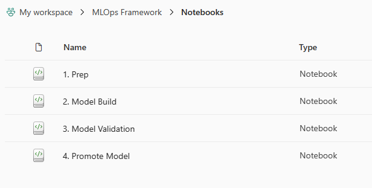

# Fabric MLOps Accelerator
This repo is an accelerator help to help kick start using MLOps with Microsoft Fabric.  Microsoft Fabric supports mlflow and uses the Azure Machine Learning model registry to support managing models inside of a workspace. 

## Setup Steps
1. Create a Development Workspace to contain the artifacts.

2. Within the workspace create a new folder designating the Project for the given model development work (in my case it is MLOps Framework)

    

3. Clone this repo

4. Import the Notebooks from the folder in this repo (4. Promote Model is work in progress and will be available soon)

    

    

5. Open up the [1. Prep](/Notebooks/1.%20Prep.ipynb) Notebook

6. Connect to a Lakehouse

7. Create a folder named iris and upload the iris.csv file
    
    

8. Execute the notebook.  You should now have a table and a file named transformed_iris.parquet

   

9. Open up the [2. Model Build](/Notebooks/2.%20Model%20Build.ipynb) Notebook

10. Execute the notebook.  Once completed, you should see an XGBoost-Experiement1 artifact in the root of your workspace.

    

11. Move the file to the Experiments folder (this is to help organize)

    

12. Open up the [3. Model Validation](/Notebooks/3.%20Model%20Validation.ipynb) Notebook

13. Execute the notebook.  Once completed, you should see a new model in the root.

    

    Move this model to the Models folder in the same way you move the Experiment artifact.

## Configuration for your use case
To configure this for your use case, you will need to take a few steps.

1. Modify the [1. Prep](/Notebooks/1.%20Prep.ipynb) Notebook to reflect the notebook, experiment and model names.

2. Update the [2. Model Build](/Notebooks/2.%20Model%20Build.ipynb) Notebook with your specific model building logic.

3. Update the [3. Model Validation](/Notebooks/3.%20Model%20Validation.ipynb) Notebook to reflect the metrics you wish to use to determine the quality.  

4. Schedule the Model Build and Validation on a cadence.  The Validation is build to be able to be executed over and over and will not register a new model if the metrics are not better.

## To Do
These are the todos.

1. Add a method to move the models between workspaces and execute.

2. Add logic to call the second notebook from the first once building is complete.

